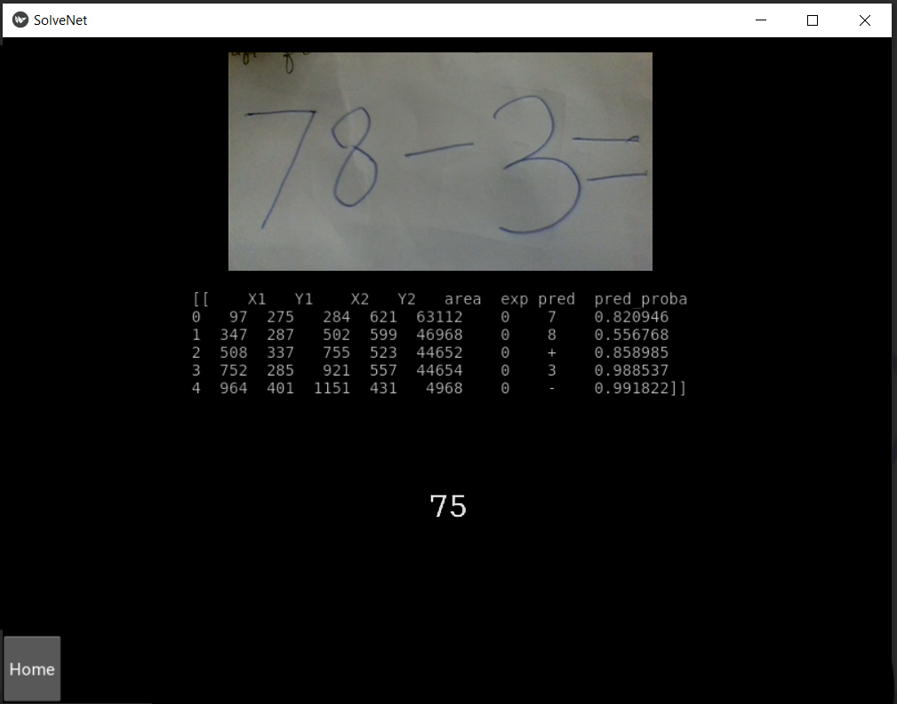

# SolveNet

## Abstract
A system which can first segment the digits and symbols in the image. Then it predicts the segmented text character by character to recognize the text. Once the text is recognized, the text needs to be formulated into a mathematical expression, which can be calculated to achieve the final goal of the system, i.e., evaluate an image of handwritten mathematical expressions.

##### System Architechture


## Execution Instructions
Create and activate the environment for the project:
```
conda create -n environment.yml
conda activate SolveNet

python3 sn.py
```

## Screenshots
##### Home Screen


##### Upload Screen


##### Capture Screen


##### Result Screen


## Contributors
1.	[Aadit Agarwal](https://github.com/aaditagarwal/)\
	ABV-IIITM, Gwalior\
	agarwal.aadit99@gmail.com
2.	[Aastha Jain](https://github.com/aasthajain12/)\
	ABV-IIITM, Gwalior\
	jainaastha806@gmail.com	
3.	[Himanshu Ruhela](https://github.com/verdantfire/)\
	ABV-IIITM, Gwalior\
	himanshuruhela013@gmail.com